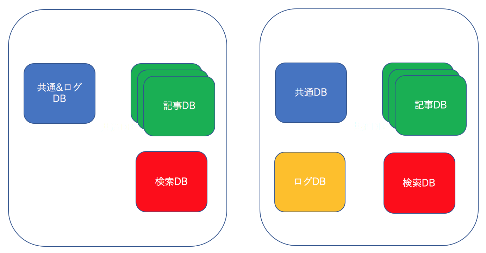

### 今まで経験したプロジェクトの個人的な振り返り
#### Start up div 中村真一郎

---
### アジェンダ
- 自動車生産管理システムの話
- ブログをフルリプレースの話
- プリクラアプリのバックエンドの話
- バックオフィス支援システムの話

---
### 自動車生産管理システムの話
#### プロジェクト概要
- ある自動車会社の生産管理、受注管理をするシステムをJavaで作る案件。
- 複数の会社が絡み、当時所属していた会社が中心となって開発を進めていた
- 使っていた技術
  - EJB(えらい人が銀の弾丸と思っていた)
  - カタリシス法によるコンポーネントベース開発(えらい人がこれも銀の弾丸と思っていた)

+++
### 自動車生産管理システムの話
- カタリシスとは

+++
### 自動車生産管理システムの話
#### やったこと
- カタリシスで作ったことないけど、契約時点で「その方法だとうまくいくんですよ」と言う話で決まっていてやる前から進め方が決まっていたので皆んなで勉強
- 関連会社も知らないから、教えながら進める（でも実際プロジェクトで使うの始めただから、皆んな自信ない)
- とりあえず仲良くなるために飲み会する
- まずは話を聞いてコンポーネント設計して、それをお客さんにレビューしてもらう

+++
### 自動車生産管理システムの話
#### 結果と学び
- 理想だけの話ばかりで、一向に開発が進まない。このやり方にお客さんが疑問を持ち、会社ごと切られる。
  - 未経験の新しい技術を詰め込みすぎて結局自分たちの首を締めた。
- EJBもカタリシスも銀の弾丸じゃないよ
  - その場に適した技術を選択すべき。

---
### ブログフルリプレースの話
#### プロジェクト概要
- コードのメンテナンスが苦しくなり、生産性に問題を起こしてきた。フルスクラッチで書き直す
- 表示速度も遅くなり、テーブル、データ構成の再考が必要になった

+++
### ブログフルリプレースの話
#### やったこと
- 表示速度の改善
- テストも整備してデグレーションもなくす
- DB構成、テーブル構成も見直す(DB（物理)のマシン数を減らしてコストを減らす)

+++
### ブログフルリプレースの話

+++
### ブログフルリプレースの話
#### 結果と学び
- 表示速度が4秒以下に改善された
- ログ系のデータを分離して別にすることで共通DBの負荷が下がった
  - 今ならDBとかでなく、ログファイルにしてFulentD/elasticsearchやTreasureDataに突っ込むなどなどですかね
- 正確にログを取り出したら3億近くPVがあったが、実際はもう少し少なかったのでは疑惑が出てきた。
- 仕様把握している人が誰もいなかったため、後から色々と不具合が出てきた
 - 仕様をドキュメント化するなどしておくことは大事

+++
### ブログフルリプレースの話
#### 結果と学び
- テストを作ってやっていたが、他のメンバーはテストを作るのが面倒で後からやるとなって、結局作らなかった
 - テストを後から作るは、ダメ。やるときに作らないと
- 既存改修とリプレース作業の両方をやる必要があった.
 - 企画や営業などへの説明不足。上の人の間では決まっていても末端までその意図が伝わっていなかった。
 - 両方やるため、進捗が悪かった。
   - ここはちゃんと分けるべき

---
### プリクラアプリのバックエンドの話
#### プロジェクト概要
- iphone/Androidプリクラアプリのサーバサイドを担当
- スタンプ作ったりして、写真をデコレートできる
- 東南アジア（台湾、タイ)でも使われているアプリだったので、他言語

+++
### プリクラアプリのバックエンドの話

+++
### プリクラアプリのバックエンドの話
#### やったこと
- Ruby/Railsで開発
- Rspecなどでテストはちゃんと書く
- Herokuで運用(サーバサイド一人だったので)

+++
### プリクラアプリのバックエンドの話
#### 結果と学び
- テストをほぼ全クラスに対し作ったので、品質はよかった
- 一人で誰もレビューしてなかったので、後から見てコードのメンテナンス性がよくなかった
  - 1年以上経ってから社内の一人をリクルートしてRuby/Railsを学んでもらってコードレビュー出来るようになった
- Heroku(Amazon)で何度か障害が起きた年で、プロダクトオーナーから「Herokuは嫌いだ」と言われてしまった。
  - レイテンシーの問題もありそれから暫くしてAWSに移行

---
### バックオフィス支援システムの話
#### プロジェクト概要
- 月末に必要な計算を自動化するシステム
- 税理士さんが使うもの

+++
### バックオフィス支援システムの話
#### やったこと
- 細かい計算処理の部分のテストを徹底して書く
- 車内で実際に使ってもらう
- 1月から初めて3月末にリリース(結構ギリ)
- 4月以降も随時機能追加

+++
### バックオフィス支援システムの話
#### 結果と学び
- ここでもテストの重要性を痛感
- チームの勤怠が結構バラバラ(寝坊して15時に出社とか)なので、そういう中でコードレビューすることの難しさを痛感
  - チームで働くなら勤務時間は揃えたい
  - 場合によっては話して説明した方が効率が良い
- コードに対するこだわりが強すぎるのも・・・
  - こう書きたいという思いは大事だけど、固執し過ぎて開発が一向に進まないのも辛い

---
### まとめ
- 要件まとめなど最初のフェーズが大事
- テスト大事
- コードレビュー必要があれば直接説明するなどした方が変な誤解がなくて良い
- 落とし所は大事

---
### おわり

