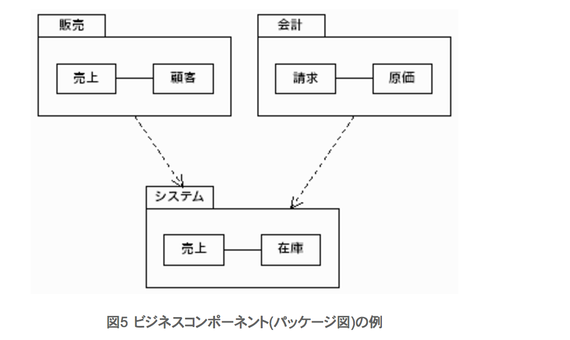

### 今まで経験したプロジェクトの個人的な振り返り
#### Start up div 中村真一郎

---
### アジェンダ
- 自動車生産管理システムを担当した時の話
- ブログをフルリプレースした時の話
- プリクラアプリのバックエンドを作った時の話
- 給与システムを作った時の話

---
### 自動車生産管理システムを担当した時の話
#### プロジェクト概要
- ある自動車会社の生産管理、受注管理をするシステムをJavaで作る案件。
- 複数の会社が絡み、当時所属していた会社が中心となって開発を進めていた
- 使っていた技術
  - EJB(えらい人が銀の弾丸と思っていた)
  - カタリシス法によるコンポーネントベース開発(えらい人がこれも銀の弾丸と思っていた)

+++
### 自動車生産管理システムを担当した時の話
#### やったこと
- カタリシスで作ったことないけど、契約時点で「その方法だとうまくいくんですよ」と言う話で決まっていてやる前から進め方が決まっていたので皆んなで勉強
- 関連会社も知らないから、教えながら進める（でも実際プロジェクトで使うの始めただから、皆んな自信ない)
- とりあえず仲良くなるために飲み会する
- まずは話を聞いてコンポーネント設計して、それをお客さんにレビューしてもらう

+++
### 自動車生産管理システムを担当した時の話
#### 結果と学び
- 理想だけの話ばかりで、一向に開発が進まない。このやり方にお客さんが疑問を持ち、会社ごと切られる。
  - 未経験の新しい技術を詰め込みすぎて結局自分たちの首を締めた。
- EJBもカタリシスも銀の弾丸じゃないよ
  - その場に適した技術を選択すべき。

---
### ブログフルリプレースした時の話
#### プロジェクト概要
- コードのメンテナンスが苦しくなり、生産性に問題を起こしてきた。フルスクラッチで書き直す
- 表示速度も遅くなり、テーブル、データ構成の再考が必要になった

+++
### ブログフルリプレースした時の話
#### やったこと
- 表示速度の改善
- テストも整備してデグレーションもなくす
- DB構成、テーブル構成も見直す(DB（物理)のマシン数を減らしてコストを減らす)

+++
### ブログフルリプレースした時の話
#### 結果と学び
- 表示速度が4秒以下に改善された
- ログ系のデータを分離して別にすることで共通DBの負荷が下がった
- 正確にログを取り出したら3億近くPVがあったが、実際はもう少し少なかったのでは疑惑が出てきた。
- 仕様把握している人が誰もいなかったため、後から色々と不具合が出てきた
 - 仕様をドキュメント化するなど何かしらで残しておくことは大事
- テストを作ってやっていたが、他のメンバーはテストを作るのが面倒で後からやるとなって、結局作らなかった
 - テストを後から作るは、ダメ。やるときに作らないと

### おわり

